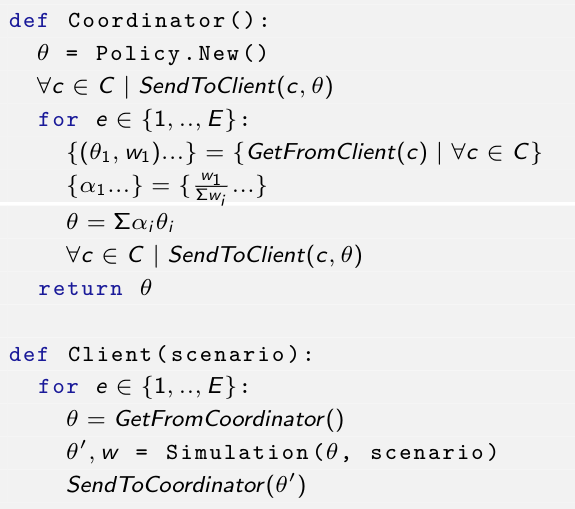

### Transfer Learning through Federated Learing

<figure>

</figure>

### The Multi-Agent Simulation Setting

  <figure>
  
  <figcaption>Ring-Road of a Metropolitan City </figcaption>
  </figure>

  <figure>
  
  <figcaption>4-Way Double-Lane Traffic Light Regulated Intersection </figcaption>
  </figure>

### The Multi-Agent Reinforcement Learning Story So Far

<figure>

<figcaption>Comparison of Approaches for Rearching Demand Coverage</figcaption>
</figure>

<figure>

<figcaption>Agents sharing Observation </figcaption>
</figure>

<figure>

<figcaption>Agents sharing Rewards </figcaption>
</figure>

### Centralized Reinforcement Learning

<figure>

</figure>

### Federated Reinforcement Learning

<figure>

</figure>

### The Simulator: UXsim

UXSim is a Free and Open-Source *macroscopic* and *mesoscopic* network
traffic flow simulator. It’s tailored to simulate private-mobility
simulations. It’s **"Lightweight"**, **Library-Based** and **Written
in Python**.

  <figure>
  
  </figure>

  <figure>
  
  </figure>

### The Agent Model

  <ul>
    <li>The Agent can change Traffic Light Phase every 10 seconds</li>
    <li>Each one of the two *phases* gives *right of way* to one of the two flows</li>
    <li>The Agent can see the density of vehicles in each one of the roads (input/output)</li>
    <li>The Agent is rewarded based on vehicle queues’ length, specifically on the amount vehicles en/dequeuing</li>
  </ul>

  <figure>
  
  <figcaption>4-Way Double-Lane Traffic Light Regulated
  Intersection</figcaption>
  </figure>

### The Traffic Model

  <figure>
  
  <figcaption>Ring-Road of a Metropolitan City </figcaption>
  </figure>

  <ul>
    <li>Two-Lanes per Road Link</li>
    <li>Road Length is 1000 m = 1 km</li>
    <li>Free Flow Speed is 20 m/s ≈ 72 km/h</li>
    <li>Traffic Jam Density is set to $ρ = 0.2 \approx 40$ veh/lane/1km</li>
    <li>No Platoons allowed, as in the Real-World (at least for now ...)</li>
    <li>No simulated Pedestrian Crossing, nor Public Transit (of any kind)</li>
  </ul>

### The Demand Model / Training Scenarios

  <figure>
  
  <figcaption>Ring-Road of a Metropolitan City </figcaption>
  </figure>

  <ul>
    <li>All Mid Piazzale Fratelli Zavattari</li>
    <li>Peak East to West Piazzale Loreto</li>
    <li>Peak West to East Piazza Simone Bolivar</li>
    <li>Peak North to South Piazza Firenze</li>
    <li>Peak South to North Piazzale Lodi</li>
  </ul>

### The Demand Model / Evaluation Scenarios

  <figure>
  
  <figcaption>Ring-Road of a Metropolitan City </figcaption>
  </figure>

  <ul>
    <li>Training Scenarios</li>
    <li>+ 5 ×  Random Demand</li>
    <li>Each entry of the four (EW, WE, NS, SN) is random</li>
    <li>Demand is in range $[0.3, 0.8]$</li>
    <li>The demand’s percentage describes the amount of vehicles per unit of capacity</li>
  </ul>

### The FedAvg Algorithm

  <figure>
  
  <figcaption>Variant of FedAvg used</figcaption>
  </figure>

  <ul>
    <li>Knowledge is weighted on the complexity of the scenario of a client</li>
    <li>... which is equal to the demand that the client has to deal with</li>
    <li>Due to resource constrains, only 5 Peers were used, with no client sampling</li>
    <li>The duration of a simulation is 3600*s* = 1*h**r* = 360 steps.</li>
  </ul>

### Results / Training

<figure>

<figcaption>Total Reward during Training over Time
(Episodes)</figcaption>
</figure>

### Results / Evaluation

<figure>

<figcaption>Average Total Reward during Evaluation over Time (Initial +
Episodes)</figcaption>
</figure>

### Results / The Federated Coordinator is Catching Up!

<figure>

<figcaption>Average Total Reward during Evaluation over Time (Initial +
Episodes)</figcaption>
</figure>

### Comparisons / Fixed-Cycle Agents

<figure>

<figcaption>Average Total Reward during Evaluation of Fixed-Cycle Agents
(<em>CTLA_Ts</em> means <em>T</em>
seconds per phase)</figcaption>
</figure>

### Comparisons / Is Deep Q-Learning Worth the Effort?

<figure>

<figcaption>Comparison of Average Total Reward obtained by Deep
Q-Learning Models and Fixed-Cycle Agents during Evaluation</figcaption>
</figure>

### Comparisons / Is Deep Q-Learning Worth the Effort?

<figure>

<figcaption>Comparison of Average Total Reward obtained by Deep
Q-Learning Models and Fixed-Cycle Agents during Evaluation</figcaption>
</figure>

### Visualizing that Reward Difference

  <figure>
  
  <figcaption>Microscopic visualization of Fixed-Agent (10s per
  phase)</figcaption>
  </figure>

  <figure>
  
  <figcaption>Microscopic visualization of Fixed-Agent (60s per
  phase)</figcaption>
  </figure>

### Visualizing that Reward Difference

  <figure>
  
  <figcaption>Microscopic visualization of Centralized Learning
  Agent</figcaption>
  </figure>

  <figure>
  
  <figcaption>Microscopic visualization of Federated Learning
  Agent</figcaption>
  </figure>

### Bibliography

 - [1] TuttoCitta. Map of Piazzale Lodi, Milan, Italy. TuttoCitt`a. Accessed: April 20, 2026. Screenshot by author. 2026. url: www.tuttocitta.it/mappa/milano/piazzale-lodi.
 - [2] Refolli Francesco. “Unconventional Reinforcement Learning on Traffic Lights with Sumo”. In: September 2025. url: https://github.com/frefolli/master-presentation.
 - [3] Toru Seo. “UXsim: lightweight mesoscopic traffic flow simulator in pure Python”. In: Journal of Open Source Software 10.106 (2025), p. 7617. doi: 10.21105/joss.07617. url: https://doi.org/10.21105/joss.07617.
 - [4] Takashi Nagatani. “The physics of traffic jams”. In: Reports on progress in physics 65.9 (2002), pp. 1331–1386.
 - [5] Corriere della Sera. Disegno del percorso della linea tranviaria circolare per Milano. 1973.
