### The Multi-Agent Simulation Setting

0.5

<figure>
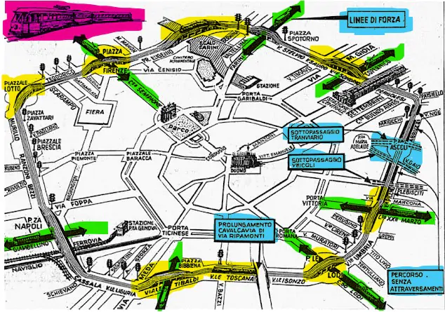
<figcaption>Ring-Road of a Metropolitan City </figcaption>
</figure>

0.5

<figure>
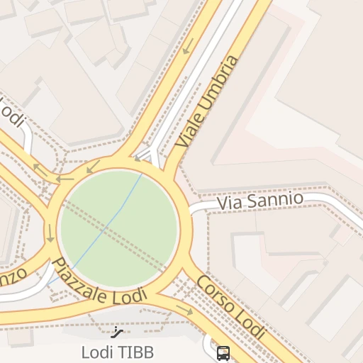
<figcaption>4-Way Double-Lane Traffic Light Regulated Intersection </figcaption>
</figure>

### The Multi-Agent Reinforcement Learning Story So Far

<figure>
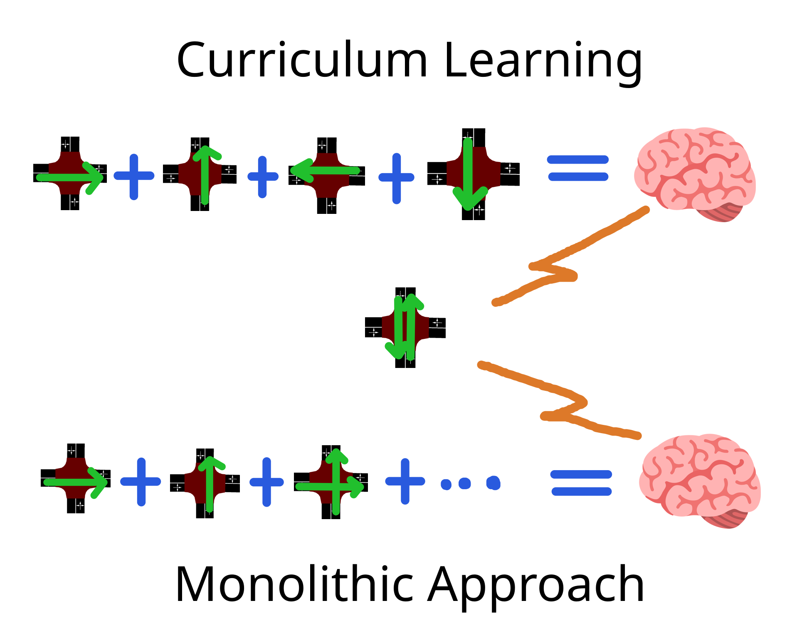
<figcaption>Comparison of Approaches for Rearching Demand Coverage</figcaption>
</figure>

### The Multi-Agent Reinforcement Learning Story So Far

<figure>
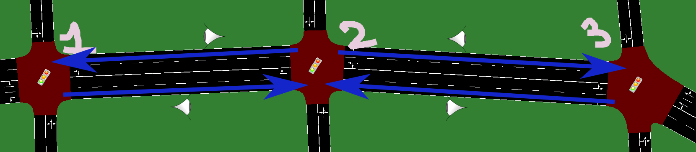
<figcaption>Agents sharing Observation </figcaption>
</figure>

<figure>
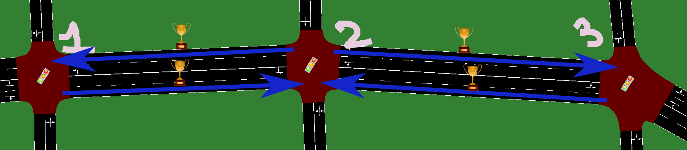
<figcaption>Agents sharing Rewards </figcaption>
</figure>

### Centralized Reinforcement Learning

<figure>
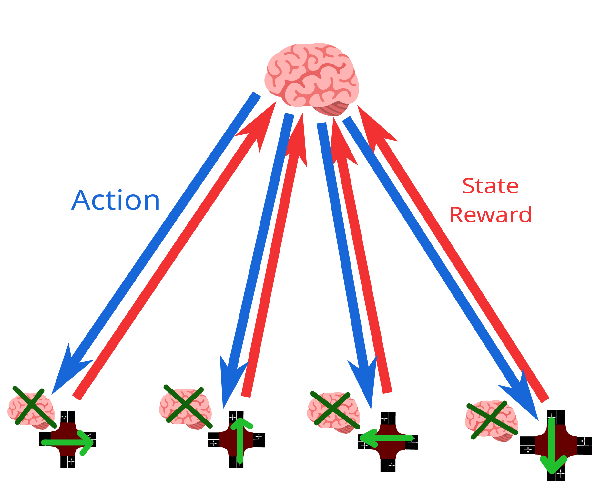
</figure>

### Federated Reinforcement Learning

<figure>
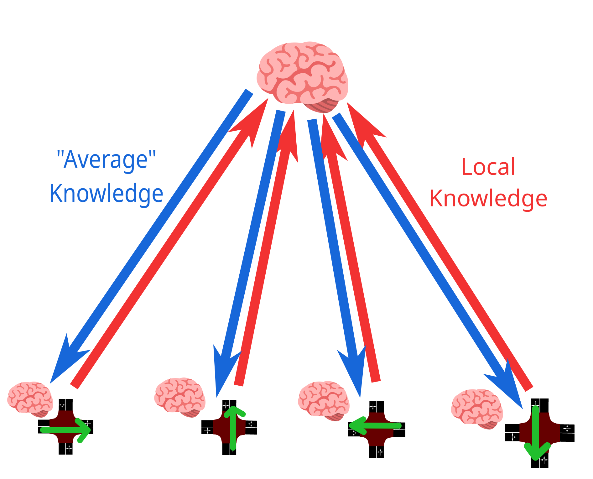
</figure>

### The Simulator: UXsim

UXSim is a Free and Open-Source *macroscopic* and *mesoscopic* network
traffic flow simulator. It’s tailored to simulate private-mobility
simulations. It’s a **"Lightweight"**, **Library-Based** and **Written
in Python**.

0.5

<figure>
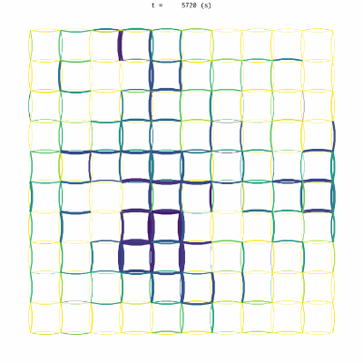
</figure>

0.5

<figure>
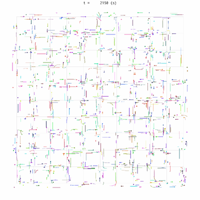
</figure>

### The Agent Model

0.5

-   The Agent can change Traffic Light Phase every 10 seconds

-   Each one of the two *phases* gives *right of way* to one of the two
    flows

-   The Agent can see the density of vehicles in each one of the roads
    (input/output)

-   The Agent is rewarded based on vehicle queues’ length, specifically
    on the amount vehicles en/dequeuing

0.5

<figure>
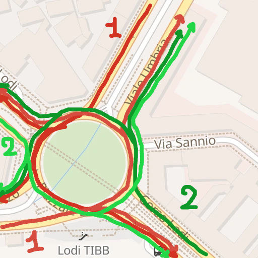
<figcaption>4-Way Double-Lane Traffic Light Regulated
Intersection</figcaption>
</figure>

### The Traffic Model

0.5

<figure>

<figcaption>Ring-Road of a Metropolitan City </figcaption>
</figure>

0.5

-   Two-Lanes per Road Link

-   Road Length is 1000 m = 1 km

-   Free Flow Speed is 20 m/s ≈ 72 km/h

-   Traffic Jam Density is set to *ρ* = 0.2 *a**p**p**r**o**x* 40
    veh/2lanes/1km

-   No Platoons allowed, as in the Real-World (at least for now ...)

-   No simulated Pedestrian Crossing, nor Public Transit (of any kind)

### The Demand Model / Training Scenarios

0.5

<figure>

<figcaption>Ring-Road of a Metropolitan City </figcaption>
</figure>

0.5

-   All Mid  
    (**Piazzale Fratelli Zavattari**)

-   Peak East to West  
    (**Piazzale Loreto**)

-   Peak West to East  
    (**Piazza Simone Bolivar**)

-   Peak North to South  
    (**Piazza Firenze**)

-   Peak South to North  
    (**Piazzale Lodi**)

### The Demand Model / Evaluation Scenarios

0.5

<figure>

<figcaption>Ring-Road of a Metropolitan City </figcaption>
</figure>

0.5

-   Training Scenarios

-   + 5 ×  Random Demand

-   Each entry of the four (EW, WE, NS, SN) is random

-   Demand is in range \[0.3, 0.8\]

-   The demand’s percentage describes the amount of vehicles per unit of
    capacity

### The FedAvg Algorithm

0.5

    def Coordinator():
      $\theta$ = Policy.New()
      $\forall c \in C \; | \; SendToClient(c, \theta)$
      for $e \in \{1,..,E\}$:
        $\{(\theta_1, w_1) ...\} = \{ GetFromClient(c) \; | \; \forall c \in C\}$
        $\{\alpha_1 ...\} = \{\frac {w_1} {\Sigma w_i} ...\}$
        $\theta = \Sigma \alpha_i \theta_i$
        $\forall c \in C \; | \; SendToClient(c, \theta)$
      return $\theta$

    def Client(scenario):
      for $e \in \{1,..,E\}$:
        $\theta = GetFromCoordinator()$
        $\theta', w$ = Simulation($\theta$, scenario)
        $SendToCoordinator(\theta')$

0.5

-   Knowledge is weighted on the complexity of the scenario of a client

-   ... which is equal to the demand that the client has to deal with

-   Due to resource constrains, only 5 Peers were used, with no client
    sampling

-   The duration of a simulation is 3600*s* = 1*h**r* = 360 steps.

### Results / Training

<figure>
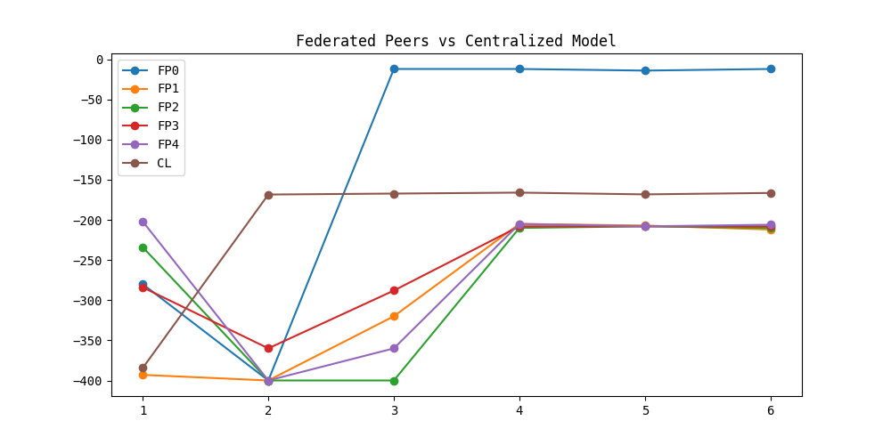
<figcaption>Total Reward during Training over Time
(Episodes)</figcaption>
</figure>

### Results / Evaluation

<figure>
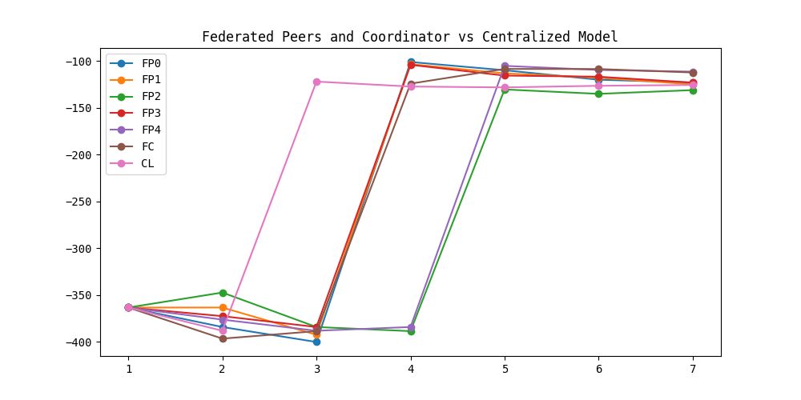
<figcaption>Average Total Reward during Evaluation over Time (Initial +
Episodes)</figcaption>
</figure>

### Results / The Federated Coordinator is Catching Up!

<figure>
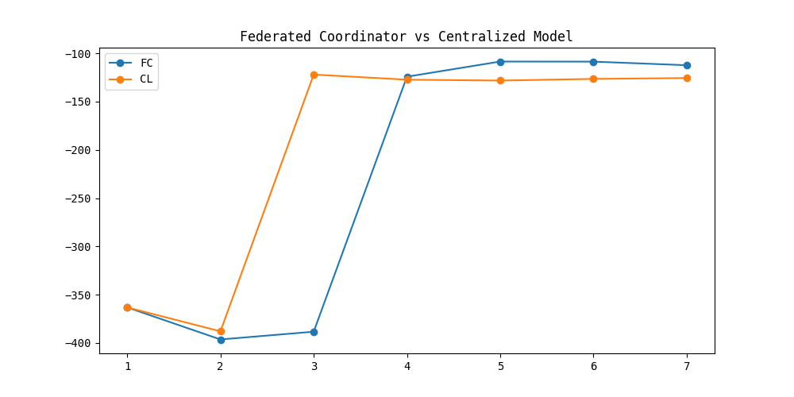
<figcaption>Average Total Reward during Evaluation over Time (Initial +
Episodes)</figcaption>
</figure>

### Comparisons / Fixed-Cycle Agents

<figure>
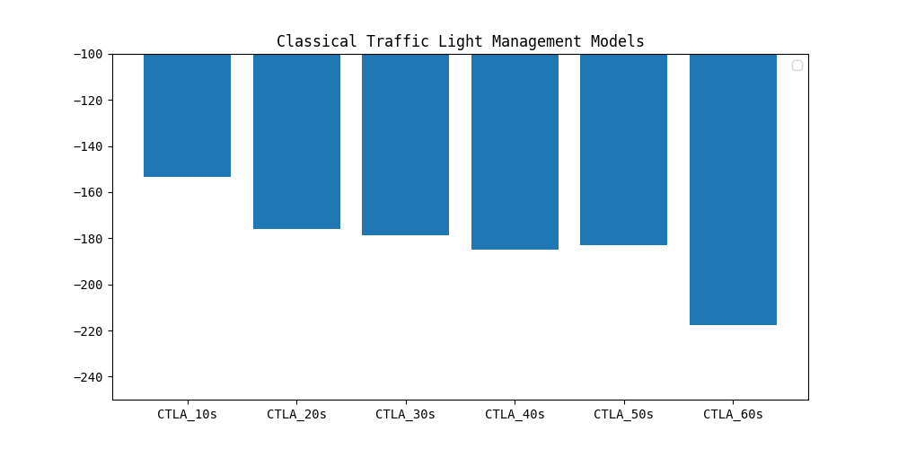
<figcaption>Average Total Reward during Evaluation of Fixed-Cycle Agents
(<em>CTLA_Ts</em> means <em>T</em>
seconds per phase)</figcaption>
</figure>

### Comparisons / Is Deep Q-Learning Worth the Effort?

<figure>
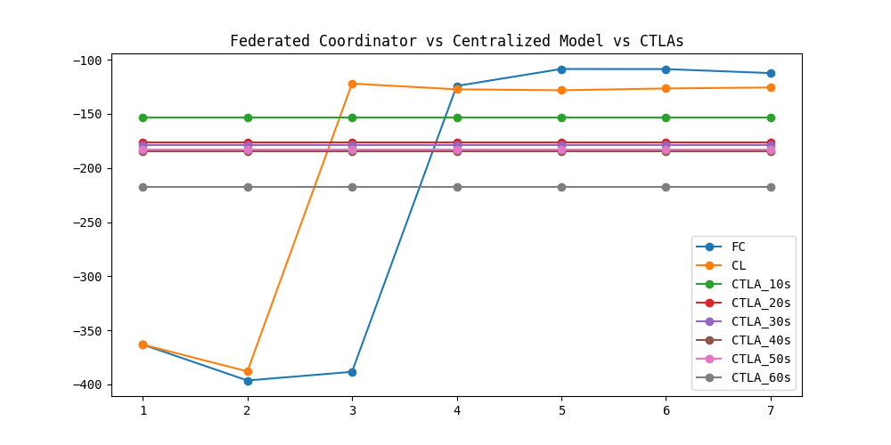
<figcaption>Comparison of Average Total Reward obtained by Deep
Q-Learning Models and Fixed-Cycle Agents during Evaluation</figcaption>
</figure>

### Comparisons / Is Deep Q-Learning Worth the Effort?

<figure>
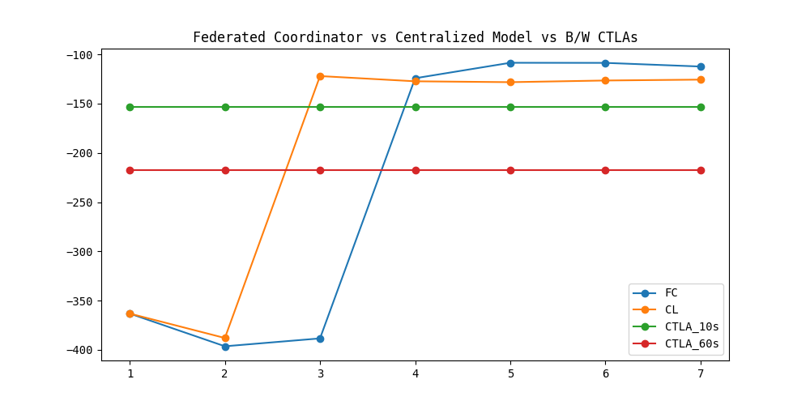
<figcaption>Comparison of Average Total Reward obtained by Deep
Q-Learning Models and Fixed-Cycle Agents during Evaluation</figcaption>
</figure>

### Visualizing that Reward Difference

0.5

<figure>

<figcaption>Microscopic visualization of Fixed-Agent (10s per
phase)</figcaption>
</figure>

0.5

<figure>

<figcaption>Microscopic visualization of Fixed-Agent (60s per
phase)</figcaption>
</figure>

### Visualizing that Reward Difference

0.5

<figure>
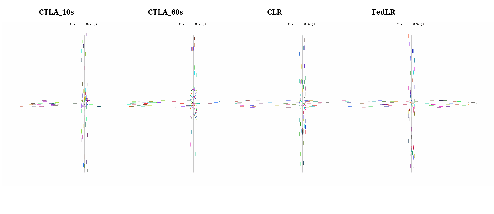
<figcaption>Microscopic visualization of Centralized Learning
Agent</figcaption>
</figure>

0.5

<figure>

<figcaption>Microscopic visualization of Federated Learning
Agent</figcaption>
</figure>

Thank You

<figure>
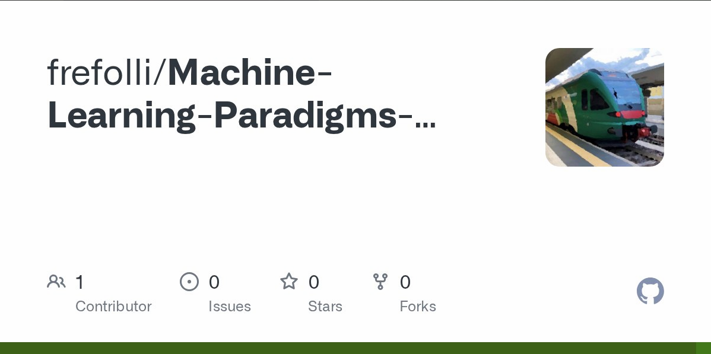
</figure>

### Bibliography
